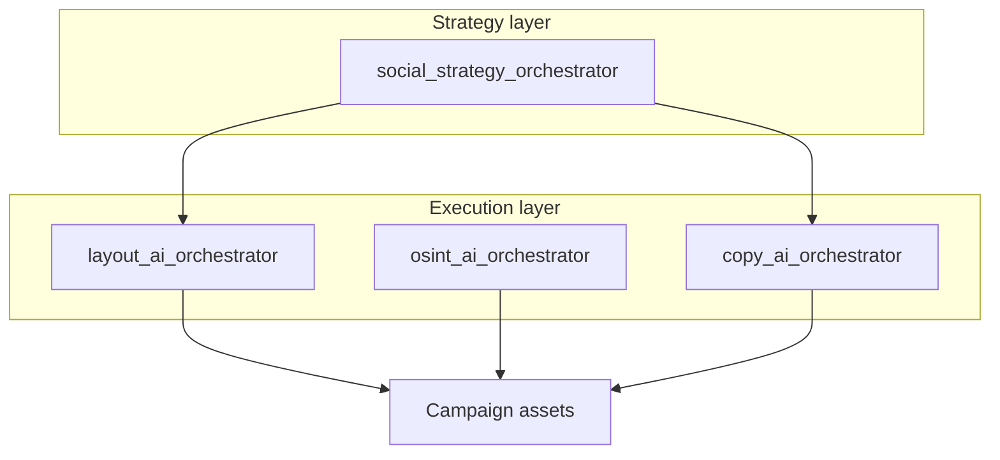

# AI Skills

Modular Agent Skills for AI-assisted campaigns. Compatible with Cursor and the [Agent Skills](https://agentskills.io/what-are-skills) specification.

## Overview

Four intelligence stacks work together to form a complete **AI Campaign Engine**:

## Structure

| Stack | Path | Purpose |
|-------|------|---------|
| **Domain (Bahia)** | [water-sanitation-bahia-skills/](water-sanitation-bahia-skills/) | Water & sanitation regulation, compliance, legal risk |
| **Social Strategy** | [social-strategy-skills/](social-strategy-skills/) | Brief analysis, narrative, hooks, distribution |
| **Design** | [design-skills/](design-skills/) | Instagram layouts, typography, virality |
| **OSINT** | [osint-skills/](osint-skills/) | Open-source intelligence pipeline |
| **Copy** | [copy-skills/](copy-skills/) | Persuasive copy, editorial, linguistics |

Each stack has its own README with detailed architecture and Mermaid diagrams.

### Domain layer (use first)

The **water-sanitation-bahia-skills** domain layer provides verified legal references and legal risk assessment. Use before OSINT, strategy, copy, or design when content involves water and sanitation in Bahia.

## Usage

Each skill contains a `SKILL.md` file with YAML frontmatter and Markdown instructions.

- **Cursor**: Add the path to your skills configuration or copy skill folders to `~/.cursor/skills/`
- **Format**: [Agent Skills](https://agentskills.io/what-are-skills) specification
