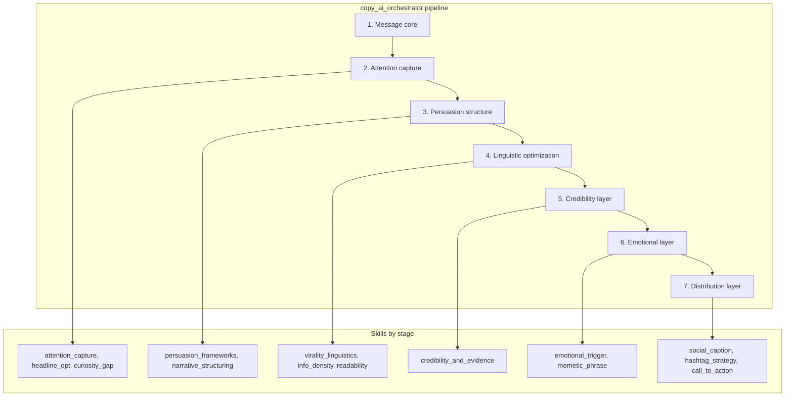

# Copy Skills

Modular skill architecture for **persuasive copywriting**: editorial depth, psychological persuasion, and linguistic optimization. Part of the Copy Intelligence Stack for high-attention, credible social media content.

## What it does

Generates copy through a 7-stage pipeline:

- Scroll-stopping hooks and headlines
- Persuasion frameworks (AIDA, PAS, BAB)
- Curiosity gaps for sustained engagement
- Narrative structuring (investigative/awareness)
- Virality linguistics and readability
- Credibility and evidence integration
- Platform-specific captions, hashtags, CTAs

## Architecture

## Pipeline

| Stage | Purpose |
|-------|---------|
| Message core | Main message, audience, campaign goal |
| Attention capture | Hooks, headlines, curiosity gaps |
| Persuasion structure | AIDA/PAS/BAB, narrative arcs |
| Linguistic optimization | Virality patterns, density, readability |
| Credibility layer | Evidence, sources, attribution |
| Emotional layer | Triggers, memetic phrases |
| Distribution layer | Platform captions, hashtags, CTAs |

## Skills

| Skill | Purpose |
|-------|---------|
| `copy_ai_orchestrator` | Master pipeline controller |
| `attention_capture_engine` | First-second scroll-stopping hooks |
| `persuasion_frameworks_engine` | AIDA, PAS, BAB application |
| `curiosity_gap_generator` | Sustained engagement across slides |
| `narrative_structuring_engine` | Investigative/awareness story arcs |
| `headline_optimization_engine` | High-impact headline generation |
| `virality_linguistics_engine` | Shareability linguistic patterns |
| `social_caption_optimizer` | Platform-specific formatting |
| `readability_optimizer` | Mobile-first readability |
| `credibility_and_evidence_engine` | Evidence integration, attribution |
| `information_density_optimizer` | Cognitive load management |
| `emotional_trigger_engine` | Engagement triggers, credibility-preserving |
| `hashtag_strategy_engine` | Discoverability hashtag sets |
| `call_to_action_engine` | Awareness, advocacy, petition CTAs |
| `memetic_phrase_generator` | Repeatable, shareable phrases |

## Integration

Works alongside `layout_ai_orchestrator` (design) and `osint_ai_orchestrator` (OSINT) to form the complete **AI Campaign Engine**.

## Format

`SKILL.md` files with YAML frontmatter and Markdown instructions. [Agent Skills](https://agentskills.io/what-are-skills) specification.
