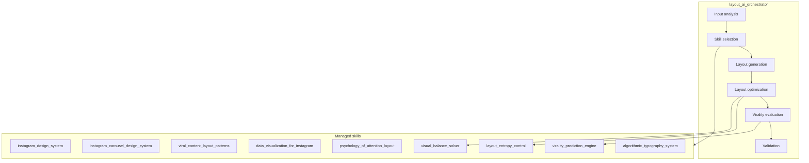
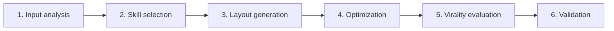

# Design Skills

Modular skill architecture for **Instagram layout generation**: grids, typography, visual balance, and virality prediction. Optimized for carousels, infographics, and single posts (1080×1350).

## What it does

Generates layout structures with:

- Deterministic grid systems
- Typography scales and baseline rhythm
- Visual balance algorithms
- Virality scoring (0–100)
- Attention heatmap alignment

## Architecture

## Pipeline

| Stage | Purpose |
|-------|---------|
| Input analysis | Content type, layout goal, visual priority |
| Skill selection | Activate skills by content type (single, carousel, infographic) |
| Layout generation | Grid, typography, primary focus |
| Optimization | Balance, entropy, attention alignment |
| Virality evaluation | Score 0–100, iterate if low |
| Validation | Grid alignment, readability, no overlap |

## Skills

| Skill | Purpose |
|-------|---------|
| `layout_ai_orchestrator` | Master pipeline controller |
| `instagram_design_system` | Single-post layout engine (1080×1350) |
| `instagram_carousel_design_system` | Multi-slide carousels |
| `viral_content_layout_patterns` | High-engagement patterns |
| `data_visualization_for_instagram` | Charts, infographics |
| `psychology_of_attention_layout` | Gestalt, attention zones |
| `visual_balance_solver` | Center-of-mass balance |
| `layout_entropy_control` | Visual entropy regulation |
| `virality_prediction_engine` | Viral potential scoring |
| `algorithmic_typography_system` | Typography scales, rhythm |

## Format

`SKILL.md` files with YAML frontmatter and Markdown instructions. [Agent Skills](https://agentskills.io/what-are-skills) specification.
