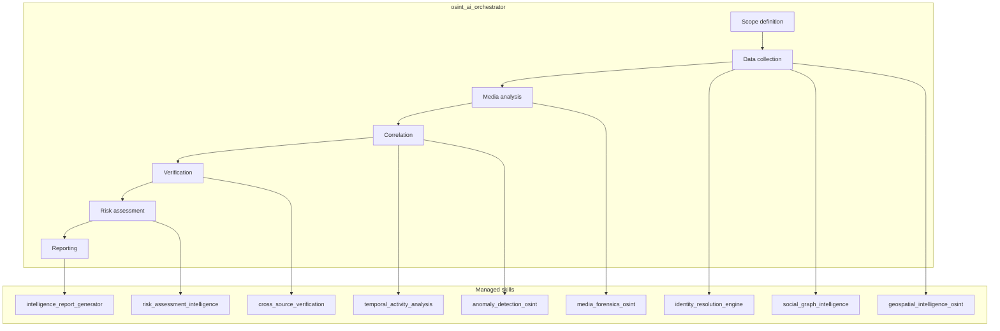

# OSINT Skills

Modular skill architecture for **open-source intelligence** investigations using public data. Designed for journalism, research, threat intelligence, and lawful investigations.

## What it does

Performs structured OSINT pipelines:

- Entity discovery and alias correlation
- Relationship and influence mapping
- Location intelligence from public data
- Timeline reconstruction
- Media authenticity verification
- Cross-source evidence validation
- Anomaly detection
- Structured intelligence reports

## Architecture

## Pipeline

| Stage | Purpose |
|-------|---------|
| Scope definition | Objective, entity type, required sources |
| Data collection | Identity resolution, social graph, geospatial |
| Media analysis | Image/video forensics |
| Correlation | Temporal analysis, anomaly detection |
| Verification | Cross-source validation |
| Risk assessment | Relevance/threat scoring |
| Reporting | Structured intelligence output |

## Skills

| Skill | Purpose |
|-------|---------|
| `osint_ai_orchestrator` | Master pipeline controller |
| `identity_resolution_engine` | Entity discovery, alias correlation |
| `social_graph_intelligence` | Relationship and influence mapping |
| `geospatial_intelligence_osint` | Location intelligence |
| `temporal_activity_analysis` | Timeline reconstruction |
| `media_forensics_osint` | Image/video authenticity |
| `cross_source_verification` | Multi-source validation |
| `anomaly_detection_osint` | Unusual pattern detection |
| `risk_assessment_intelligence` | Threat/relevance scoring |
| `intelligence_report_generator` | Structured report output |

## Legal & Ethical Scope

These skills support **lawful** open-source intelligence: journalism, research, threat intelligence, and investigations using public data. They do not support hacking, intrusion, or illegal surveillance.

## Format

`SKILL.md` files with YAML frontmatter and Markdown instructions. [Agent Skills](https://agentskills.io/what-are-skills) specification.
