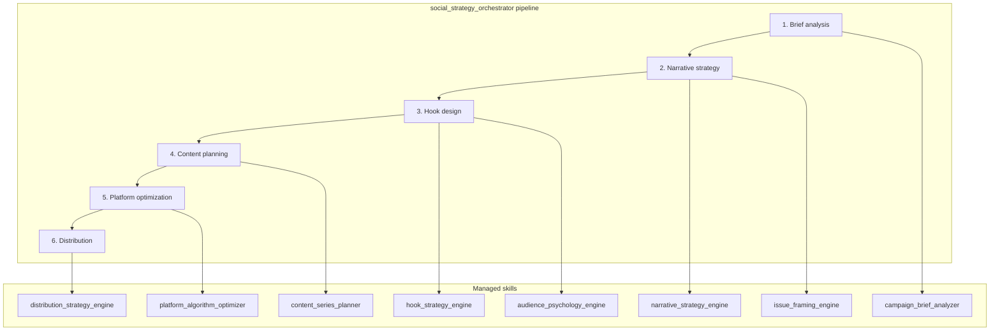
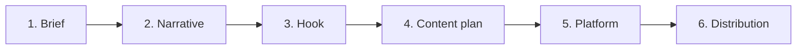
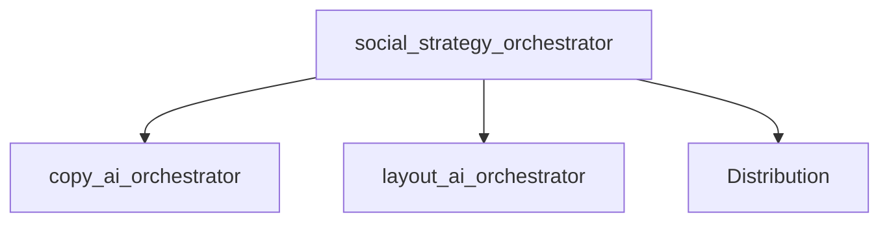

# Social Strategy Skills

Modular skill architecture for **campaign strategy**: brief analysis, narrative design, hook strategy, audience psychology, and distribution. The strategic layer that sits above copy, design, and OSINT — transforming briefs into complete social campaigns.

## What it does

Transforms campaign briefs into actionable strategy through:

- Brief analysis (PAIA framework)
- Narrative and issue framing
- Hook and audience psychology
- Content series planning
- Platform algorithm optimization
- Distribution strategy

## Architecture

## Pipeline

| Stage | Purpose |
|-------|---------|
| Brief analysis | Problem, audience, key message |
| Narrative strategy | Macro narrative, issue framing |
| Hook design | Core hook, audience psychology |
| Content planning | Series structure across posts |
| Platform optimization | Instagram algorithm alignment |
| Distribution | Organic, influencer, community |

## Skills

| Skill | Purpose |
|-------|---------|
| `social_strategy_orchestrator` | Master strategy pipeline controller |
| `campaign_brief_analyzer` | Brief → strategy (PAIA framework) |
| `narrative_strategy_engine` | Macro campaign narrative |
| `hook_strategy_engine` | Core attention hook |
| `audience_psychology_engine` | Behavioral science resonance |
| `issue_framing_engine` | Rights, accountability, systemic framing |
| `content_series_planner` | Multi-post series structure |
| `platform_algorithm_optimizer` | Instagram distribution mechanics |
| `distribution_strategy_engine` | Organic, influencer, community |

## Position in AI Campaign Engine

Sits **above** the execution layers. Output feeds into:

- `copy_ai_orchestrator` — copy generation
- `layout_ai_orchestrator` — design generation
- Distribution channels — amplification

## Format

`SKILL.md` files with YAML frontmatter and Markdown instructions. [Agent Skills](https://agentskills.io/what-are-skills) specification.
