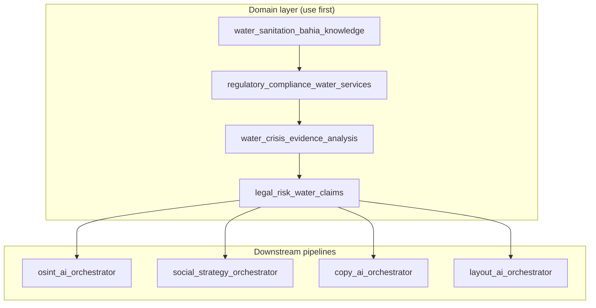
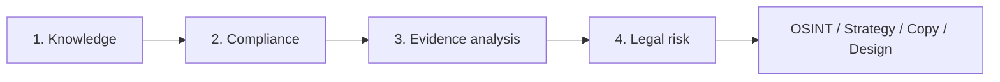

# Water & Sanitation Bahia Skills

Domain micro-stack for **water supply and sanitation regulation in Bahia, Brazil**. Verified legal references, compliance evaluation, and legal risk assessment. Safe for public repositories and public communication.

## What it does

Provides a factual, legally-grounded base for content about water and sanitation:

- **Verified norms**: Lei 11.445/2007, Lei 14.026/2020, Lei Estadual 11.172/2008, Resolução AGERSA 002/2017
- **Compliance evaluation**: continuity, restoration time, consumer rights
- **Evidence analysis**: SINISA, SISAGUA, regulatory reports, complaint records — separates fact, analysis, inference
- **Legal risk layer**: low/medium/high risk framing, prohibited claims

## Architecture



## Pipeline



| Stage | Skill | Purpose |
|-------|-------|---------|
| 1 | `water_sanitation_bahia_knowledge` | Legal and institutional base |
| 2 | `regulatory_compliance_water_services` | Compliance evaluation |
| 3 | `water_crisis_evidence_analysis` | Technical analysis of SINISA, SISAGUA, regulatory data |
| 4 | `legal_risk_water_claims` | Legal exposure assessment |

## Skills

| Skill | Purpose |
|-------|---------|
| `water_sanitation_bahia_knowledge` | Verified norms, AGERSA, ANA, institutional roles |
| `regulatory_compliance_water_services` | Compliance dimensions, safe phrasing |
| `water_crisis_evidence_analysis` | Evidence analysis (SINISA, SISAGUA, complaint records) |
| `legal_risk_water_claims` | Risk levels, preferred/avoided frames |

## Integration

**Use before** any OSINT, strategy, copy, or design. Evidence-based pipeline:

```
Technical data → water_crisis_evidence_analysis → legal_risk_water_claims → strategy → copy → design
```

Ensures:

- Correct legal base
- Defensible evidence (avoids fragile interpretations)
- Safe language
- Avoids defamation
- Maintains public credibility

## Legal scope

Based on Brazilian federal and state legislation and technical-legal opinion. Prohibits speculative corruption claims, criminal attribution, and unsupported statements. High-risk claims require judicial decision support.

## Format

`SKILL.md` files with YAML frontmatter and Markdown instructions. [Agent Skills](https://agentskills.io/what-are-skills) specification.
